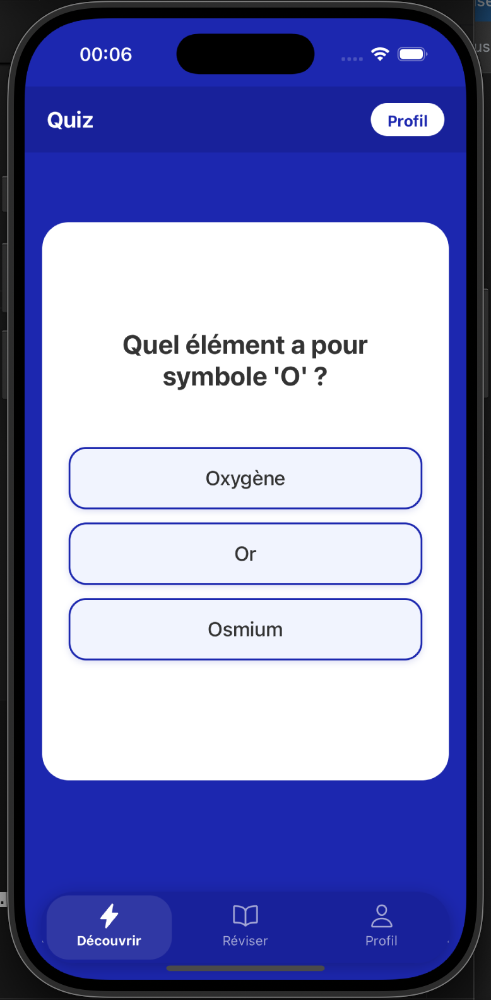
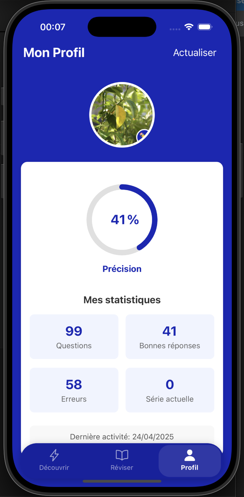
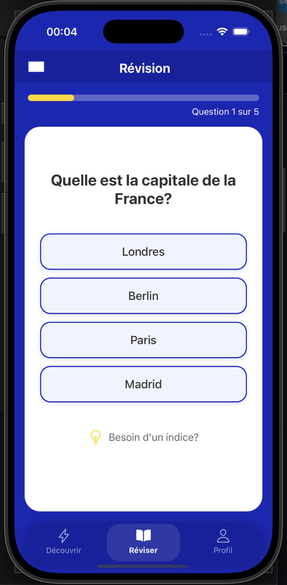

## App Sections

- **Quiz**: Multiple-choice questions with feedback
- **Review**: Practice mode with progress tracking
- **Profile**: Simple statistics tracking

## About the Project

This is a learning project to practice React Native development while exploring some basic concepts in educational apps. It's a work in progress with plenty of room for improvement.


## Overview

A simple quiz application for children built with React Native. This project was created as a way to practice React Native development and explore educational technology concepts.

The app features basic quiz questions on subjects like science and geography, with a clean and straightforward interface designed for young users.

## Features

- Simple quiz interface with multiple-choice questions
- Basic progress tracking in the profile section
- Review mode for practicing questions
- Immediate feedback on answers

## Screenshots

<div align="center">
  <table>
    <tr>
      <td></td>
      <td></td>
      <td></td>
    </tr>
  </table>
</div>

## Technologies Used

- React Native
- JavaScript
- React Navigation
- AsyncStorage

## Getting Started

### Prerequisites

- Node.js
- npm or yarn
- React Native setup

### Installation

1. Clone the repository:
   ```bash
   git clone https://github.com/encoreunpseudo/QuizzAppChildren.git
   cd QuizzAppChildren
   ```

2. Install dependencies:
   ```bash
   npm install
   ```

3. Start the application:
   ```bash
   npx react-native start
   npx react-native run-android  # or run-ios
   ```

## Project Structure

```
QuizzAppChildren/
├── android/            # Android native code
├── ios/                # iOS native code
├── src/
│   ├── components/     # UI components
│   ├── screens/        # App screens
│   ├── navigation/     # Navigation setup
│   └── data/           # Quiz questions
└── README.md           # Documentation
```
